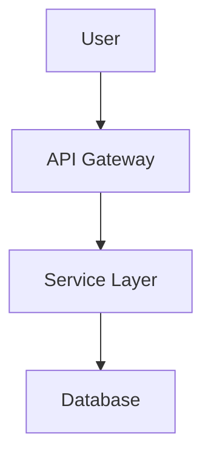
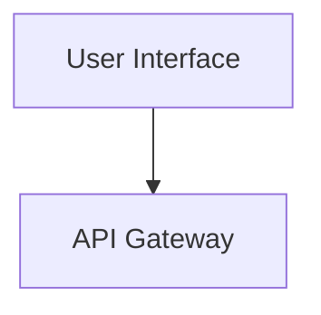
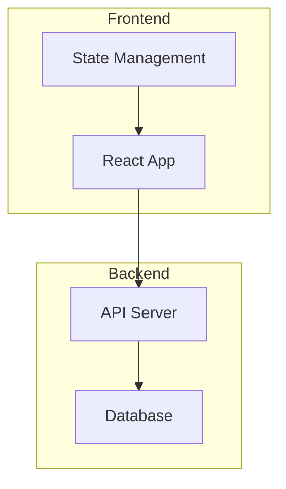

# Visual Communication Protocol

**Version:** 1.0.0
**Status:** Active
**Date:** 2026-01-30

## Purpose

This protocol defines standards for visual output across all Loa agents using Mermaid diagrams with Beautiful Mermaid (agents.craft.do/mermaid) as the default rendering service.

## When to Include Diagrams

### Required (Must Include)

| Agent | Required Diagrams |
|-------|-------------------|
| designing-architecture | System architecture, component interactions, data models, state machines |
| translating-for-executives | Executive summary diagrams, high-level flows |

### Optional (Agent Discretion)

| Agent | Suggested Diagrams |
|-------|-------------------|
| discovering-requirements | User journeys, process flows |
| planning-sprints | Sprint workflow, task dependencies |
| reviewing-code | Code flow diagrams |

## Diagram Type Selection

| Type | Mermaid Syntax | Use Case |
|------|----------------|----------|
| **Flowchart** | `graph TD` / `graph LR` | System architecture, process flows, decision trees |
| **Sequence** | `sequenceDiagram` | API interactions, agent communication, request flows |
| **Class** | `classDiagram` | Object models, type relationships, domain models |
| **State** | `stateDiagram-v2` | State machines, lifecycle diagrams, status flows |
| **ER** | `erDiagram` | Database schemas, data models, entity relationships |

## Output Format

Each diagram must follow this hybrid format (code + preview URL):

```markdown
### {Diagram Title}

```mermaid
{mermaid_source}
```

> **Preview**: [View diagram]({preview_url})
```

### Example

```markdown
### Component Architecture



> **Preview**: [View diagram](https://agents.craft.do/mermaid?code=Z3JhcGggVEQKICAgIEFbVXNlcl0gLS0-IEJbQVBJIEdhdGV3YXldCiAgICBCIC0tPiBDW1NlcnZpY2UgTGF5ZXJdCiAgICBDIC0tPiBEW0RhdGFiYXNlXQ&theme=github)
```

## Preview URL Generation

### URL Format

```
https://agents.craft.do/mermaid?code={base64_mermaid}&theme={theme_name}
```

### Base64 Encoding

1. Take raw Mermaid source code
2. Encode as Base64
3. Make URL-safe: replace `+` with `-`, `/` with `_`, remove `=` padding

### Manual Generation

```bash
# Using mermaid-url.sh script
echo 'graph TD; A-->B' | .claude/scripts/mermaid-url.sh --stdin

# Direct encoding
echo -n 'graph TD; A-->B' | base64 -w0 | tr '+/' '-_' | tr -d '='
```

## Theme Configuration

### Reading Theme

Agents should read theme from `.loa.config.yaml`:

```yaml
visual_communication:
  theme: "github"  # Default theme
```

### Available Themes

| Theme ID | Description | Best For |
|----------|-------------|----------|
| `github` | GitHub light mode | Documentation, PRs (default) |
| `dracula` | Dark purple | Dark mode users |
| `nord` | Arctic blue | Accessibility |
| `tokyo-night` | Dark blue | IDE integration |
| `solarized-light` | Warm light | Print-friendly |
| `solarized-dark` | Warm dark | Low-light environments |
| `catppuccin` | Pastel dark | Modern aesthetic |

## Fallback Behavior

### Large Diagrams

If Mermaid source exceeds 1500 characters:
1. Include the Mermaid code block (always)
2. Omit the preview URL
3. Add note: `> *Diagram too large for preview - render locally in VS Code or GitHub*`

### Offline Mode

If preview URLs are disabled via config (`include_preview_urls: false`):
1. Include Mermaid code blocks only
2. Do not generate preview URLs

### Service Unavailable

Mermaid code blocks work without the external service. Users can render locally using:
- VS Code Mermaid extension
- GitHub markdown preview
- Any Mermaid-capable viewer

## Configuration Reference

```yaml
# .loa.config.yaml
visual_communication:
  enabled: true                              # Master toggle
  service: "https://agents.craft.do/mermaid" # Rendering service
  theme: "github"                            # Default theme
  include_preview_urls: true                 # Generate preview links
  diagram_types:
    flowchart: true
    sequence: true
    class: true
    state: true
    er: true
```

## Mermaid Syntax Requirements

### General Rules

1. Use clear, descriptive node labels
2. Prefer `TD` (top-down) for hierarchical diagrams
3. Prefer `LR` (left-right) for process flows
4. Keep diagrams focused - split complex systems into multiple diagrams
5. Use subgraphs to group related components

### Node Naming



### Subgraph Usage



## Integration with Skills

### SKILL.md Reference

Skills that support visual communication should include:

```markdown
<visual_communication>
## Visual Communication

Follow `.claude/protocols/visual-communication.md` for diagram standards.

### Required Diagrams
- {list required diagram types}

### Output Format
Include Mermaid code block + preview URL for each diagram.
</visual_communication>
```

## Privacy & Security

### Data Transmission

Diagram content is encoded in the URL and sent to agents.craft.do/mermaid for rendering.

**What's sent:**
- Mermaid source code (base64 URL-encoded)
- Theme parameter

**What's NOT sent:**
- Your project metadata
- Git information
- File paths
- Credentials or secrets

### Privacy Recommendation

For diagrams containing proprietary architecture or security-sensitive details, use offline rendering:

1. Set `include_preview_urls: false` in `.loa.config.yaml`
2. Render locally using VS Code Mermaid extension or GitHub preview

### Input Validation

The `mermaid-url.sh` script validates:
- Theme names against an allowlist (prevents injection)
- Diagram size (rejects >1500 chars per protocol)
- Basic Mermaid syntax (requires valid diagram type)
- Config values (only allows safe characters)

## Related

- `.claude/scripts/mermaid-url.sh` - URL generator script
- `.loa.config.yaml` - Configuration file
- SDD Section 4 - Component design details
