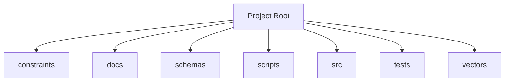

<!-- AGENT-CONTEXT
name: @0xhoneyjar/loa-hounfour
type: protocol-library
purpose: Constitutional protocol contracts for an AI agent economy — loa-finn ↔ arrakis integration layer
key_files: [CLAUDE.md, package.json, src/, constraints/, schemas/, vectors/]
dependencies: [node, typescript]
capability_requirements:
  - filesystem: read
  - filesystem: write (scope: src)
  - git: read_write
  - shell: execute
-->

# @0xhoneyjar/loa-hounfour

Constitutional protocol contracts for an AI agent economy — loa-finn ↔ arrakis integration layer.

TypeScript protocol schema library built with TypeBox. Produces JSON Schema 2020-12 definitions with cross-field constraint validation. Consumed as an npm package by loa-finn and arrakis.

## Key Capabilities

- **157 TypeBox schemas** across 9 modules (core, economy, model, governance, constraints, integrity, graph, composition, validators)
- **72 constraint files** with a custom constraint DSL and 42 evaluator builtins
- **5,000+ tests** with conformance vectors for cross-language validation
- **JSON Schema 2020-12** generation for Python/Go/Rust consumers

## Architecture

The library is organized as a modular protocol specification:



Directory structure:
```
./constraints        # Protocol constraint files (72 files)
./docs               # Protocol documentation
./docs/architecture  # Design decisions, SDD, capability schemas
./docs/choreography  # Interaction patterns: sale, gift, custody change
./docs/integration   # Runtime contracts between consumers
./docs/patterns      # Reusable protocol patterns
./docs/requirements  # Product requirements
./schemas            # Generated JSON Schema files (160 schemas)
./scripts            # Build and utility scripts
./src                # TypeBox schema definitions
./src/composition    # Composition schemas
./src/constraints    # Constraint DSL and evaluator
./src/core           # Agent identity, messages, lifecycle
./src/economy        # Billing, JWT, escrow, economic boundary
./tests              # Vitest test suites
./vectors            # Conformance test vectors (202 files)
```

## Module Map

| Module | Files | Purpose | Documentation |
|--------|-------|---------|---------------|
| `constraints/` | 73 | Protocol constraint files | -- |
| `docs/` | 20+ | Protocol specification | [docs/README.md](docs/README.md) |
| `schemas/` | 160 | Generated JSON Schema 2020-12 | [schemas/README.md](schemas/README.md) |
| `scripts/` | 11 | Build and utility scripts | -- |
| `src/` | 155 | TypeBox schema definitions | -- |
| `tests/` | 188+ | Vitest test suites | -- |
| `vectors/` | 202 | Conformance test vectors | -- |

## Verification

- 5,390+ tests across 188 test files
- CI/CD: GitHub Actions
- Type safety: TypeScript (strict mode, ES2022+, ESM)
- Security: SECURITY.md present, `.gitleaksignore`, `.trufflehog.yaml`

## Ecosystem

### Dependencies
- `@noble/hashes` — Keccak-256 for EIP-55
- `@sinclair/typebox` — Runtime types + JSON Schema generation
- `canonicalize` — Deterministic JSON serialization
- `fast-check` — Property-based testing
- `jose` — JWT operations
- `vitest` — Test framework

## Quick Start

```bash
# npm
npm install @0xhoneyjar/loa-hounfour

# pnpm
pnpm add @0xhoneyjar/loa-hounfour
```

```typescript
import { ... } from '@0xhoneyjar/loa-hounfour';           // Everything
import { ... } from '@0xhoneyjar/loa-hounfour/core';      // Agents, messages
import { ... } from '@0xhoneyjar/loa-hounfour/economy';   // Billing, JWT, escrow
import { ... } from '@0xhoneyjar/loa-hounfour/governance'; // Delegation, permissions
import { ... } from '@0xhoneyjar/loa-hounfour/constraints'; // Constraint DSL
```
