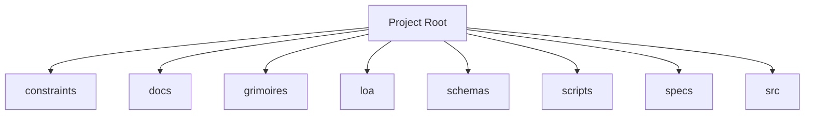

<!-- AGENT-CONTEXT
name: @0xhoneyjar/loa-hounfour
type: framework
purpose: Constitutional protocol contracts for an AI agent economy — loa-finn ↔ arrakis integration layer
key_files: [CLAUDE.md, .claude/loa/CLAUDE.loa.md, .loa.config.yaml, .claude/scripts/, .claude/skills/, package.json]
interfaces:
dependencies: [git, jq, yq, node]
ecosystem:
  - repo: 0xHoneyJar/loa-finn
    role: runtime
    interface: hounfour-router
    protocol: loa-hounfour@7.9.2
  - repo: 0xHoneyJar/loa-dixie
    role: reputation
    interface: npm-package
    protocol: loa-hounfour@7.9.2
  - repo: 0xHoneyJar/loa-freeside
    role: billing
    interface: npm-package
    protocol: loa-hounfour@7.9.2
  - repo: 0xHoneyJar/arrakis
    role: distribution
    interface: jwt-auth
    protocol: loa-hounfour@7.9.2
version: v1.41.0
trust_level: L3-hardened
-->

# @0xhoneyjar/loa-hounfour

<!-- provenance: DERIVED -->
Constitutional protocol contracts for an AI agent economy — loa-finn ↔ arrakis integration layer

Built with TypeScript/JavaScript, Python, Shell. The project has 4 direct dependencies.

## Key Capabilities
<!-- provenance: DERIVED -->
The project exposes 15 key entry points across its public API surface.

### loa/.claude/adapters

- **_build_provider_config** — Build ProviderConfig from merged hounfour config. (`loa/.claude/adapters/cheval.py:152`)
- **_check_feature_flags** — Check feature flags. (`loa/.claude/adapters/cheval.py:192`)
- **_error_json** — Format error as JSON for stderr (SDD §4.2.2 Error Taxonomy). (`loa/.claude/adapters/cheval.py:77`)
- **_load_persona** — Load persona.md for the given agent with optional system merge (SDD §4.3.2). (`loa/.claude/adapters/cheval.py:96`)
- **cmd_cancel** — Cancel a Deep Research interaction. (`loa/.claude/adapters/cheval.py:511`)
- **cmd_invoke** — Main invocation: resolve agent → call provider → return response. (`loa/.claude/adapters/cheval.py:211`)
- **cmd_poll** — Poll a Deep Research interaction. (`loa/.claude/adapters/cheval.py:467`)
- **cmd_print_config** — Print effective merged config with source annotations. (`loa/.claude/adapters/cheval.py:442`)
- **cmd_validate_bindings** — Validate all agent bindings. (`loa/.claude/adapters/cheval.py:453`)
- **main** — CLI entry point. (`loa/.claude/adapters/cheval.py:547`)

### loa/.claude/adapters/loa_cheval/config

- **LazyValue** — Deferred interpolation token. (`loa/.claude/adapters/loa_cheval/config/interpolation.py:41`)
- **_check_env_allowed** — Check if env var name is in the allowlist. (`loa/.claude/adapters/loa_cheval/config/interpolation.py:122`)
- **_check_file_allowed** — Validate and resolve a file path for secret reading. (`loa/.claude/adapters/loa_cheval/config/interpolation.py:133`)
- **_get_credential_provider** — Get the credential provider chain (lazily initialized, thread-safe). (`loa/.claude/adapters/loa_cheval/config/interpolation.py:192`)
- **_matches_lazy_path** — Check if a dotted config key path matches any lazy path pattern. (`loa/.claude/adapters/loa_cheval/config/interpolation.py:275`)

## Architecture
<!-- provenance: DERIVED -->
The architecture follows a three-zone model: System (`.claude/`) contains framework-managed scripts and skills, State (`grimoires/`, `.beads/`) holds project-specific artifacts and memory, and App (`src/`, `lib/`) contains developer-owned application code.

Directory structure:
```
./constraints
./dist
./docs
./docs/adr
./docs/architecture
./docs/choreography
./docs/history
./docs/integration
./docs/patterns
./docs/requirements
./grimoires
./grimoires/loa
./loa
./loa/docs
./loa/evals
./loa/grimoires
./loa/tests
./schemas
./scripts
./specs
./src
./src/composition
./src/constraints
./src/core
./src/economy
./src/governance
./src/graph
./src/integrity
./src/model
./src/schemas
```

## Module Map
<!-- provenance: DERIVED -->
| Module | Files | Purpose | Documentation |
|--------|-------|---------|---------------|
| `constraints/` | 78 | Constraints | \u2014 |
| `docs/` | 24 | > `@0xhoneyjar/loa-hounfour` — Shared protocol contracts for the loa-finn <-> arrakis integration | [docs/README.md](docs/README.md) |
| `grimoires/` | 10 | Loa state and memory files | \u2014 |
| `loa/` | 1529 | <!-- AGENT-CONTEXT: Loa is an agent-driven development framework for Claude | [loa/README.md](loa/README.md) |
| `schemas/` | 171 | **Contract version:** | [schemas/README.md](schemas/README.md) |
| `scripts/` | 11 | Utility scripts | \u2014 |
| `specs/` | 1 | Specs | \u2014 |
| `src/` | 162 | Source code | \u2014 |
| `tests/` | 266 | Test suites | \u2014 |
| `vectors/` | 246 | Vectors | \u2014 |

## Verification
<!-- provenance: CODE-FACTUAL -->
- Trust Level: **L3 — Property-Based**
- 266 test files across 1 suite
- CI/CD: GitHub Actions (1 workflows)
- Type safety: TypeScript
- Security: SECURITY.md present

## Ecosystem
<!-- provenance: OPERATIONAL -->
### Dependencies
- `@noble/hashes`
- `@sinclair/typebox`
- `@types/node`
- `canonicalize`
- `fast-check`
- `jose`
- `tsx`
- `typescript`
- `vitest`

## Quick Start
<!-- provenance: OPERATIONAL -->

```bash
# npm
npm install @0xhoneyjar/loa-hounfour

# pnpm
pnpm add @0xhoneyjar/loa-hounfour
```
<!-- ground-truth-meta
head_sha: 5f1046edef6e4eae9eb690855a9eb03ea9c953e6
generated_at: 2026-02-24T23:18:41Z
generator: butterfreezone-gen v1.0.0
sections:
  agent_context: 4ef621064facee9cd5b926a409de6eb198e319c823def66fdd2891bcfe07278c
  capabilities: 91c76b88484745b0ccfd46492d3209336d104c4c2179e8d36f67e3442f3dd93f
  architecture: adbb299fa4c212e7242c470f7f643ff67c9f68e38df394c0e7f3e064db7e015b
  module_map: 4ecde878c3658ab22df41f40f668dccd615740ee0b85340c7366c47e56a2b47c
  verification: 66e1493c1e195c5f7ead6f4f854b0ef86dbe7774d10eee45fe3ac15938e2a767
  ecosystem: 106a752a5faab1fbf6d5a71394f39fc1a568723df26c5c93a9a9d4c9e4aaf5aa
  quick_start: bbe40cc048ee3bbe1e24097064c0cf5bf532786bb91157ecd2ef96563b7e92d7
-->
