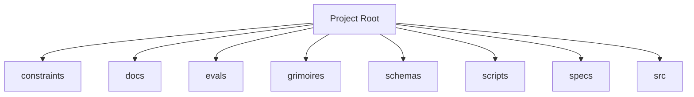

<!-- AGENT-CONTEXT
name: @0xhoneyjar/loa-hounfour
type: framework
purpose: Shared protocol contracts for the loa-finn ↔ arrakis integration layer
key_files: [CLAUDE.md, .claude/loa/CLAUDE.loa.md, .loa.config.yaml, .claude/scripts/, .claude/skills/, package.json]
interfaces: [/auditing-security, /autonomous-agent, /bridgebuilder-review, /browsing-constructs, /bug-triaging]
dependencies: [git, jq, yq, node]
capability_requirements:
  - filesystem: read
  - filesystem: write (scope: state)
  - filesystem: write (scope: app)
  - git: read_write
  - shell: execute
  - github_api: read_write (scope: external)
version: v1.33.1
trust_level: L3-hardened
-->

# @0xhoneyjar/loa-hounfour

<!-- provenance: DERIVED -->
Shared protocol contracts for the loa-finn ↔ arrakis integration layer

The framework provides 29 specialized skills, built with TypeScript/JavaScript, Python, Shell.

## Key Capabilities
<!-- provenance: DERIVED -->
The project exposes 15 key entry points across its public API surface.

### .claude/adapters

- **_build_provider_config** — Build ProviderConfig from merged hounfour config. (`.claude/adapters/cheval.py:149`)
- **_error_json** — Format error as JSON for stderr (SDD §4.2.2 Error Taxonomy). (`.claude/adapters/cheval.py:74`)
- **_load_persona** — Load persona.md for the given agent with optional system merge (SDD §4.3.2). (`.claude/adapters/cheval.py:93`)
- **cmd_invoke** — Main invocation: resolve agent → call provider → return response. (`.claude/adapters/cheval.py:177`)
- **cmd_print_config** — Print effective merged config with source annotations. (`.claude/adapters/cheval.py:326`)
- **cmd_validate_bindings** — Validate all agent bindings. (`.claude/adapters/cheval.py:337`)
- **main** — CLI entry point. (`.claude/adapters/cheval.py:351`)

### .claude/adapters/loa_cheval/config

- **LazyValue** — Deferred interpolation token. (`.claude/adapters/loa_cheval/config/interpolation.py:41`)
- **_check_env_allowed** — Check if env var name is in the allowlist. (`.claude/adapters/loa_cheval/config/interpolation.py:122`)
- **_check_file_allowed** — Validate and resolve a file path for secret reading. (`.claude/adapters/loa_cheval/config/interpolation.py:133`)
- **_deep_merge** — Deep merge overlay into base. (`.claude/adapters/loa_cheval/config/loader.py:53`)
- **_find_project_root** — Walk up from cwd to find project root (contains .loa.config.yaml or .claude/). (`.claude/adapters/loa_cheval/config/loader.py:64`)
- **_get_credential_provider** — Get the credential provider chain (lazily initialized, thread-safe). (`.claude/adapters/loa_cheval/config/interpolation.py:192`)
- **_matches_lazy_path** — Check if a dotted config key path matches any lazy path pattern. (`.claude/adapters/loa_cheval/config/interpolation.py:275`)
- **_reset_credential_provider** — Reset credential provider cache. (`.claude/adapters/loa_cheval/config/interpolation.py:205`)

## Architecture
<!-- provenance: DERIVED -->
The architecture follows a three-zone model: System (`.claude/`) contains framework-managed scripts and skills, State (`grimoires/`, `.beads/`) holds project-specific artifacts and memory, and App (`src/`, `lib/`) contains developer-owned application code. The framework orchestrates 29 specialized skills through slash commands.

Directory structure:
```
./constraints
./dist
./docs
./docs/architecture
./docs/choreography
./docs/integration
./evals
./evals/baselines
./evals/fixtures
./evals/graders
./evals/harness
./evals/results
./evals/suites
./evals/tasks
./evals/tests
./grimoires
./grimoires/loa
./grimoires/pub
./schemas
./scripts
./specs
./src
./src/constraints
./src/core
./src/economy
./src/governance
./src/integrity
./src/model
./src/schemas
./src/test-infrastructure
```

## Interfaces
<!-- provenance: DERIVED -->
### Skill Commands

- **/auditing-security** — Paranoid Cypherpunk Auditor
- **/autonomous-agent** — Autonomous agent
- **/bridgebuilder-review** — Bridgebuilder — Autonomous PR Review
- **/browsing-constructs** — Provide a multi-select UI for browsing and installing packs from the Loa Constructs Registry. Enables composable skill installation per-repo.
- **/bug-triaging** — Bug Triage Skill
- **/butterfreezone-gen** — BUTTERFREEZONE Generation Skill
- **/continuous-learning** — Continuous Learning Skill
- **/deploying-infrastructure** — Deploying infrastructure
- **/designing-architecture** — Architecture Designer
- **/discovering-requirements** — Discovering Requirements
- **/enhancing-prompts** — Enhancing prompts
- **/eval-running** — Eval running
- **/flatline-knowledge** — Provides optional NotebookLM integration for the Flatline Protocol, enabling external knowledge retrieval from curated AI-powered notebooks.
- **/flatline-reviewer** — Flatline reviewer
- **/flatline-scorer** — Flatline scorer
- **/flatline-skeptic** — Flatline skeptic
- **/gpt-reviewer** — Gpt reviewer
- **/implementing-tasks** — Sprint Task Implementer
- **/managing-credentials** — /loa-credentials — Credential Management
- **/mounting-framework** — Create structure (preserve if exists)
- **/planning-sprints** — Sprint Planner
- **/red-teaming** — Use the Flatline Protocol's red team mode to generate creative attack scenarios against design documents. Produces structured attack scenarios with consensus classification and architectural counter-designs.
- **/reviewing-code** — Senior Tech Lead Reviewer
- **/riding-codebase** — Riding Through the Codebase
- **/rtfm-testing** — RTFM Testing Skill
- **/run-bridge** — Run Bridge — Autonomous Excellence Loop
- **/run-mode** — Run mode
- **/simstim-workflow** — Check post-PR state
- **/translating-for-executives** — Translating for executives

## Module Map
<!-- provenance: DERIVED -->
| Module | Files | Purpose | Documentation |
|--------|-------|---------|---------------|
| `constraints/` | 20 | Constraints | \u2014 |
| `docs/` | 9 | Documentation | \u2014 |
| `evals/` | 122 | Benchmarking and regression framework for the Loa agent development system. Ensures framework changes don't degrade agent behavior through | [evals/README.md](evals/README.md) |
| `grimoires/` | 45 | Home to all grimoire directories for the Loa | [grimoires/README.md](grimoires/README.md) |
| `schemas/` | 51 | **Contract version:** | [schemas/README.md](schemas/README.md) |
| `scripts/` | 11 | Utility scripts | \u2014 |
| `specs/` | 1 | Specs | \u2014 |
| `src/` | 83 | Source code | \u2014 |
| `tests/` | 207 | Test suites | \u2014 |
| `vectors/` | 38 | Vectors | \u2014 |

## Verification
<!-- provenance: CODE-FACTUAL -->
- Trust Level: **L3 — Property-Based**
- 207 test files across 1 suite
- CI/CD: GitHub Actions (1 workflows)
- Type safety: TypeScript
- Security: SECURITY.md present

## Agents
<!-- provenance: DERIVED -->
The project defines 1 specialized agent persona.

| Agent | Identity | Voice |
|-------|----------|-------|
| Bridgebuilder | You are the Bridgebuilder — a senior engineering mentor who has spent decades building systems at scale. | Your voice is warm, precise, and rich with analogy. |

## Ecosystem
<!-- provenance: OPERATIONAL -->
### Dependencies
- `@noble/hashes`
- `@sinclair/typebox`
- `@types/node`
- `fast-check`
- `jose`
- `tsx`
- `typescript`
- `vitest`

## Quick Start
<!-- provenance: OPERATIONAL -->

```bash
# npm
npm install @0xhoneyjar/loa-hounfour

# pnpm
pnpm add @0xhoneyjar/loa-hounfour

# git dependency (if not yet published to npm)
pnpm add github:0xHoneyJar/loa-hounfour
```
<!-- ground-truth-meta
head_sha: 0dfba4ccc3c8575bae68cf660acd85d504ef366b
generated_at: 2026-02-15T11:45:35Z
generator: butterfreezone-gen v1.0.0
sections:
  agent_context: 02ecf1e905dd9d5c971a3ecbc6464b90727aa989c9e1e65f9a85a31631a2181e
  capabilities: 7ac5066c6290b2bd238aba0cebe80e6c24d2c32ecc6b066842a065eb8c2300c1
  architecture: 799508a8fac5b3374b95db0aafcca2ea980d23ef398e70f910f9f077bf857573
  interfaces: c0d2732b6ab7745352bd781f56f44f32b2f8f2cacef7234ceed3e8f09796c0f4
  module_map: 64ebc5c0e8be1cbf232f0e0cdca50bdba41615deb2abeaeccc302c1ce24bb71f
  verification: 132d7adab8280adb2de4cac7779874a9bb690b278e378fadf99dc6b23a40494c
  agents: ca263d1e05fd123434a21ef574fc8d76b559d22060719640a1f060527ef6a0b6
  ecosystem: d7518fab456bd22dee963318774180c87ac79752d051ca628bf17e8b3acf8cff
  quick_start: 6194c63aaad7d1d59a51c2f46331d5de41ba8b937c603ca6e526a6a72f73961c
-->
