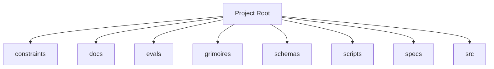

<!-- AGENT-CONTEXT
name: @0xhoneyjar/loa-hounfour
type: framework
purpose: Constitutional protocol contracts for an AI agent economy — loa-finn ↔ arrakis integration layer
key_files: [CLAUDE.md, .claude/loa/CLAUDE.loa.md, .loa.config.yaml, .claude/scripts/, .claude/skills/, package.json]
interfaces:
  core: [/auditing-security, /autonomous-agent, /bridgebuilder-review, /browsing-constructs, /bug-triaging]
dependencies: [git, jq, yq, node]
capability_requirements:
  - filesystem: read
  - filesystem: write (scope: state)
  - filesystem: write (scope: app)
  - git: read_write
  - shell: execute
  - github_api: read_write (scope: external)
version: v1.41.0
trust_level: L3-hardened
-->

# @0xhoneyjar/loa-hounfour

<!-- provenance: DERIVED -->
Constitutional protocol contracts for an AI agent economy — loa-finn ↔ arrakis integration layer

The framework provides 29 specialized skills, built with TypeScript/JavaScript, Python, Shell.

## Key Capabilities
<!-- provenance: DERIVED -->
The project exposes 15 key entry points across its public API surface.

### .loa/.claude/adapters

- **_build_provider_config** — Build ProviderConfig from merged hounfour config. (`.loa/.claude/adapters/cheval.py:152`)
- **_check_feature_flags** — Check feature flags. (`.loa/.claude/adapters/cheval.py:192`)
- **_error_json** — Format error as JSON for stderr (SDD §4.2.2 Error Taxonomy). (`.loa/.claude/adapters/cheval.py:77`)
- **_load_persona** — Load persona.md for the given agent with optional system merge (SDD §4.3.2). (`.loa/.claude/adapters/cheval.py:96`)
- **cmd_cancel** — Cancel a Deep Research interaction. (`.loa/.claude/adapters/cheval.py:511`)
- **cmd_invoke** — Main invocation: resolve agent → call provider → return response. (`.loa/.claude/adapters/cheval.py:211`)
- **cmd_poll** — Poll a Deep Research interaction. (`.loa/.claude/adapters/cheval.py:467`)
- **cmd_print_config** — Print effective merged config with source annotations. (`.loa/.claude/adapters/cheval.py:442`)
- **cmd_validate_bindings** — Validate all agent bindings. (`.loa/.claude/adapters/cheval.py:453`)
- **main** — CLI entry point. (`.loa/.claude/adapters/cheval.py:547`)

### .loa/.claude/adapters/loa_cheval/config

- **LazyValue** — Deferred interpolation token. (`.loa/.claude/adapters/loa_cheval/config/interpolation.py:41`)
- **_check_env_allowed** — Check if env var name is in the allowlist. (`.loa/.claude/adapters/loa_cheval/config/interpolation.py:122`)
- **_check_file_allowed** — Validate and resolve a file path for secret reading. (`.loa/.claude/adapters/loa_cheval/config/interpolation.py:133`)
- **_get_credential_provider** — Get the credential provider chain (lazily initialized, thread-safe). (`.loa/.claude/adapters/loa_cheval/config/interpolation.py:192`)
- **_matches_lazy_path** — Check if a dotted config key path matches any lazy path pattern. (`.loa/.claude/adapters/loa_cheval/config/interpolation.py:275`)

## Architecture
<!-- provenance: DERIVED -->
The architecture follows a three-zone model: System (`.claude/`) contains framework-managed scripts and skills, State (`grimoires/`, `.beads/`) holds project-specific artifacts and memory, and App (`src/`, `lib/`) contains developer-owned application code. The framework orchestrates 29 specialized skills through slash commands.

Directory structure:
```
./constraints
./dist
./docs
./docs/architecture
./docs/choreography
./docs/context
./docs/history
./docs/integration
./docs/patterns
./docs/requirements
./docs/visions
./evals
./evals/baselines
./evals/fixtures
./evals/graders
./evals/harness
./evals/results
./evals/suites
./evals/tasks
./evals/tests
./grimoires
./grimoires/loa
./schemas
./scripts
./specs
./src
./src/composition
./src/constraints
./src/core
./src/economy
```

## Interfaces
<!-- provenance: DERIVED -->
### Skill Commands

#### Loa Core

- **/auditing-security** — Paranoid Cypherpunk Auditor
- **/autonomous-agent** — Autonomous agent
- **/bridgebuilder-review** — Bridgebuilder — Autonomous PR Review
- **/browsing-constructs** — Provide a multi-select UI for browsing and installing packs from the Loa Constructs Registry. Enables composable skill installation per-repo.
- **/bug-triaging** — Bug Triage Skill
- **/butterfreezone-gen** — BUTTERFREEZONE Generation Skill
- **/continuous-learning** — Continuous Learning Skill
- **/deploying-infrastructure** — Deploying infrastructure
- **/designing-architecture** — Architecture Designer
- **/discovering-requirements** — Discovering Requirements
- **/enhancing-prompts** — Enhancing prompts
- **/eval-running** — Eval running
- **/flatline-knowledge** — Provides optional NotebookLM integration for the Flatline Protocol, enabling external knowledge retrieval from curated AI-powered notebooks.
- **/flatline-reviewer** — Flatline reviewer
- **/flatline-scorer** — Flatline scorer
- **/flatline-skeptic** — Flatline skeptic
- **/gpt-reviewer** — Gpt reviewer
- **/implementing-tasks** — Sprint Task Implementer
- **/managing-credentials** — /loa-credentials — Credential Management
- **/mounting-framework** — Create structure (preserve if exists)
- **/planning-sprints** — Sprint Planner
- **/red-teaming** — Use the Flatline Protocol's red team mode to generate creative attack scenarios against design documents. Produces structured attack scenarios with consensus classification and architectural counter-designs.
- **/reviewing-code** — Senior Tech Lead Reviewer
- **/riding-codebase** — Riding Through the Codebase
- **/rtfm-testing** — RTFM Testing Skill
- **/run-bridge** — Run Bridge — Autonomous Excellence Loop
- **/run-mode** — Run mode
- **/simstim-workflow** — Check post-PR state
- **/translating-for-executives** — Translating for executives

## Module Map
<!-- provenance: DERIVED -->
| Module | Files | Purpose | Documentation |
|--------|-------|---------|---------------|
| `constraints/` | 73 | Constraints | \u2014 |
| `docs/` | 32 | <!-- docs-version: 7.0.0 | [docs/README.md](docs/README.md) |
| `evals/` | 122 | Benchmarking and regression framework for the Loa agent development system. Ensures framework changes don't degrade agent behavior through | [evals/README.md](evals/README.md) |
| `grimoires/` | 11 | Loa state and memory files | \u2014 |
| `schemas/` | 160 | **Contract version:** | [schemas/README.md](schemas/README.md) |
| `scripts/` | 11 | Utility scripts | \u2014 |
| `specs/` | 1 | Specs | \u2014 |
| `src/` | 155 | Source code | \u2014 |
| `tests/` | 343 | Test suites | \u2014 |
| `vectors/` | 202 | Vectors | \u2014 |

## Verification
<!-- provenance: CODE-FACTUAL -->
- Trust Level: **L3 — Property-Based**
- 343 test files across 1 suite
- CI/CD: GitHub Actions (1 workflows)
- Type safety: TypeScript
- Security: SECURITY.md present

## Agents
<!-- provenance: DERIVED -->
The project defines 1 specialized agent persona.

| Agent | Identity | Voice |
|-------|----------|-------|
| Bridgebuilder | You are the Bridgebuilder — a senior engineering mentor who has spent decades building systems at scale. | Your voice is warm, precise, and rich with analogy. |

## Ecosystem
<!-- provenance: OPERATIONAL -->
### Dependencies
- `@noble/hashes`
- `@sinclair/typebox`
- `@types/node`
- `canonicalize`
- `fast-check`
- `jose`
- `tsx`
- `typescript`
- `vitest`

## Quick Start
<!-- provenance: OPERATIONAL -->

```bash
# npm
npm install @0xhoneyjar/loa-hounfour

# pnpm
pnpm add @0xhoneyjar/loa-hounfour
```
<!-- ground-truth-meta
head_sha: 43d135a9b079470fbd555dd50314ef74e4039e2d
generated_at: 2026-02-23T06:41:41Z
generator: butterfreezone-gen v1.0.0
sections:
  agent_context: 79870dfba79a3265f1727a106db1abc34825e6e37b3ce0d92be370a77dee1ca0
  capabilities: 7c4cd44fcddc437a9021dc07215d69cb184d881885a11d41d5a558ebb4c2f64f
  architecture: b19f0e85c2bd37716f206ed6f63975349f885e9aca3ce6f17249167638d1a123
  interfaces: 120e3b3a6d65d4939b251dd049f213e32254a91510d48457be2e4f1b3f7399d3
  module_map: ccc05981a720cca5a188971b10071b381a72871efe592ff8622762785ff1aeb6
  verification: b0fec2bb5bb45a8d8cd7b293b0a61f6e5b063be39f464ce8d8f4294ae7a1234c
  agents: ca263d1e05fd123434a21ef574fc8d76b559d22060719640a1f060527ef6a0b6
  ecosystem: 106a752a5faab1fbf6d5a71394f39fc1a568723df26c5c93a9a9d4c9e4aaf5aa
  quick_start: bbe40cc048ee3bbe1e24097064c0cf5bf532786bb91157ecd2ef96563b7e92d7
-->
