# Org Overseer Protocol — Org-As-Principal + Representative Delegation

> **Status**: Stable (introduced in v8.4.0). Source RFC: [Issue #61](https://github.com/0xHoneyJar/loa-hounfour/issues/61).
> **Audience**: Consumer engineers integrating organization-level identity, delegation chains, and constitutional succession.

The **org overseer** schemas treat an organization as a first-class cryptographic principal. The org's identity is rooted in a cold-storage `org_public_key`; day-to-day signing is performed by *representative* `AgentIdentity` records, each authorized by a signed delegation that chains back to the org key through an append-only log. Constitutional changes — amendments, rotations, additions, removals — are gated by a `SuccessionPolicy` that pins per-action quorum thresholds and cooldowns.

This document is the consumer-facing translation of [`src/governance/org-identity.ts`](../../src/governance/org-identity.ts), [`src/governance/org-representative-delegation.ts`](../../src/governance/org-representative-delegation.ts), and [`src/governance/succession-policy.ts`](../../src/governance/succession-policy.ts), together with their constraint files in [`constraints/OrgIdentity.constraints.json`](../../constraints/OrgIdentity.constraints.json), [`constraints/OrgRepresentativeDelegation.constraints.json`](../../constraints/OrgRepresentativeDelegation.constraints.json), and [`constraints/SuccessionPolicy.constraints.json`](../../constraints/SuccessionPolicy.constraints.json).

## 1. Org-As-Principal Model

The protocol distinguishes two kinds of cryptographic principal:

- **Agents** (`AgentIdentitySchema`, pre-existing) — operational signing identities. An agent may rotate keys, accept or revoke delegations, and act under a representative role.
- **Orgs** (`OrgIdentitySchema`, new in v8.4.0) — constitutional principals. An org has a single long-lived `org_public_key` (cold-storage) and a roster of `current_representatives` who sign on its behalf. The org as such never signs day-to-day workloads; it signs only *constitutional* events: founding, amendments, and the initial genesis grant of representative authority.

Why split the two? Operational signing keys rotate. Constitutional roots cannot rotate without breaking historical attribution. By separating the cold-storage org root from the rotating operational keys, the protocol keeps a stable cryptographic anchor while allowing the operational set to evolve.

### Three-schema surface

| Schema | Role | Cardinality |
|---|---|---|
| `OrgIdentity` | Snapshot of an org: cold-storage public key, current representative roster, constitutional hash | One per org; updated when reps or constitutional hash change |
| `OrgRepresentativeDelegation` | Single signed delegation record; append-only log entry | Many per org (one per grant, one per revoke; delegations form a chain) |
| `SuccessionPolicy` | Constitutional thresholds for amend/rotate/add/remove actions | One active per org (versioned via `policy_id` + `effective_at`) |

## 2. Chain-Of-Trust Verification

Every `OrgRepresentativeDelegation` record carries a `granted_by` field that **MUST** chain back to the cold-storage `org_public_key`. The terminator of the chain is a literal sentinel string:

```text
genesis:org-public-key
```

This exact string is exported from the schema source as `ORG_DELEGATION_GENESIS_SENTINEL` (see `src/governance/org-representative-delegation.ts`). Cross-runner conformance fixes the string verbatim — Go, Python, and Rust runners must use the same literal.

### Chain shape

```text
delegation_id_1.granted_by = "genesis:org-public-key"        ← genesis-rooted
delegation_id_2.granted_by = delegation_id_1.delegation_id   ← chains through 1
delegation_id_3.granted_by = delegation_id_2.delegation_id   ← chains through 2
…
chain_depth ≤ 20
```

The chain forms a DAG keyed by `delegation_id`. The library's `is_valid_dag` builtin (introduced as FR-C1 in v8.4.0) performs the structural check: no cycles, no dangling references, declared-array-order traversal, op-counted to a 100,000-op cap.

### ORD-3: chain validity (library-evaluated)

Rule **ORD-3** in `constraints/OrgRepresentativeDelegation.constraints.json` is the cross-runner-binding statement of the chain check. The expression is:

```text
chain_depth <= 20
  && is_valid_dag(granted_by_chain_records, 'delegation_id', 'granted_by')
  && (granted_by == 'genesis:org-public-key'
      || !granted_by_chain_records.every(r => r.granted_by != 'genesis:org-public-key'))
```

The third clause uses De Morgan's equivalent of "some record in the chain reaches genesis" — the constraint DSL grammar v2.0 carries `.every()` but no `.some()` quantifier; runners implementing in languages with native `.some()` may use that primitive directly.

**Critical consumer obligation — the chain context.** ORD-3 references `granted_by_chain_records`, which is **not a field on `OrgRepresentativeDelegationSchema`**. The library evaluator only picks it up when the consumer constructs a *validation context* of the form:

```typescript
{
  ...orgRepresentativeDelegationFields,
  granted_by_chain_records: [
    /* the record under validation */,
    /* every ancestor back to and including the genesis-rooted record */,
    { delegation_id: 'genesis:org-public-key' },  // ← synthetic terminator
  ],
}
```

The synthetic terminator is required because `is_valid_dag` builds an id-index up front; without an entry keyed `'genesis:org-public-key'`, the genesis-rooted record's `granted_by` would resolve to a dangling reference. A worked example lives in the schema's TSDoc and in the FR-C1 reference test corpus under `vectors/is-valid-dag/`.

When `granted_by_chain_records` is omitted, ORD-3 evaluates to vacuous-true (open-fail behavior). Consumers **SHOULD** treat the absence of chain context as a configuration error in their integration test suite, not as permission to skip enforcement.

### ORD-4: asserted-vs-traversed depth (consumer-side)

The library's `is_valid_dag` returns a boolean + structured diagnostic; it does *not* surface the traversed depth. ORD-4 (runtime-deferred) asks the consumer to walk the chain and assert that the asserted `chain_depth` field matches the depth they measure. The reconciliation closes the gap that ORD-3 leaves open: a record could declare `chain_depth: 3` but actually sit eight steps from genesis.

## 3. Asymmetric Ladder

`SuccessionPolicySchema` pins four constitutional actions to per-action `threshold` (quorum fraction in `[0, 1]`) and `cooldown_seconds` pairs. The asymmetric-ladder rule (SP-1) and the non-decreasing-cooldown rule (SP-2) together form the **constitutional ratchet**:

| Action | Threshold ordering | Cooldown ordering | Intent |
|---|---|---|---|
| `amend`  | highest  | longest  | Alters the constitution itself; requires the broadest consensus and longest reflection. |
| `rotate` | ≤ amend  | ≤ amend  | Replaces a representative with another in-place; non-membership-changing. |
| `add`    | ≤ rotate | ≤ rotate | Grows the representative set; introduces new operational authority. |
| `remove` | ≤ add    | ≤ add    | Shrinks the representative set; lowest barrier so a misbehaving representative can be removed promptly. |

Rule expressions (verbatim from the constraint file):

```text
SP-1: amend.threshold        >= rotate.threshold        >= add.threshold        >= remove.threshold
SP-2: amend.cooldown_seconds >= rotate.cooldown_seconds >= add.cooldown_seconds >= remove.cooldown_seconds
```

Why this ordering? The most consequential action (amending the constitution) requires the highest quorum to prevent constitutional capture via a low-quorum amendment. The least consequential (removing a misbehaving representative) requires the lowest quorum so that the org can move quickly when a representative is compromised. SP-2 mirrors the threshold ladder so amendments cannot be rapid-fired in succession; the cooldown buffer enforces deliberative pacing.

### `OI-1` (minimum-rep cardinality)

`OrgIdentitySchema.current_representatives` carries `minItems: 1`, and the constraint file restates this as **OI-1** so that cross-runner sweeps gate on a stable rule id. The cross-record half of the invariant — that a state-store write which would *drain* the array MUST be rejected — is consumer-side per NF-1; the library's single-record check is the floor, not the ceiling.

`SuccessionPolicySchema` deliberately does **not** carry a `self_removal_allowed` field (per OQ4 resolution in the source RFC). The rationale: OI-1 already blocks any write that would zero out `current_representatives`. Consumer-side runtime models the `governance.delegation.self_removal_pending` lifecycle for the case where a representative attempts to step down but no successor has yet been added.

## 4. Cold-Storage Root vs. Operational Keys

The protocol expects two *distinct* cryptographic key materials per org:

- **`org_public_key`** — long-lived, cold-storage. Held offline (hardware security module, paper backup, or equivalent). Used to sign the genesis delegation that bootstraps the chain. Should never be online during routine operation.
- **Representative signing keys** — operational, frequently used. Each `AgentIdentity` carries its own Ed25519 key pair (referenced by `signing_key_id` and `signed_by` on every signed record). These rotate; the rotation event itself is signed by the org under the `rotate` succession-policy action.

Operational guidance for consumers:

1. **Bootstrap**: bring `org_public_key` online once to sign the genesis `OrgRepresentativeDelegation` record (`granted_by: 'genesis:org-public-key'`). Take it offline immediately afterward.
2. **Routine delegations**: representative agents sign new delegations under their own key, with `granted_by` chaining to a prior delegation. The org key stays cold.
3. **Constitutional events**: bring the org key online only for amendments, rotations beyond the operational ladder, or representative-set updates that exceed the `rotate`-action authority of the current representatives.
4. **Compromise response**: if a representative key is suspected compromised, file a revocation record (`revocation` envelope present, `revoked: true`, `revoked_at`, `revoked_by`). The constitutional `remove` action should follow promptly to drop the representative from `current_representatives`.

## 5. Succession Policy State Machine

```mermaid
stateDiagram-v2
    [*] --> Active : SuccessionPolicy authored, effective_at <= now
    Active --> AmendProposed : quorum >= amend.threshold
    AmendProposed --> Active : amend.cooldown_seconds elapsed; new policy applied
    Active --> RotateProposed : quorum >= rotate.threshold
    RotateProposed --> Active : rotate.cooldown_seconds elapsed; representative replaced
    Active --> AddProposed : quorum >= add.threshold
    AddProposed --> Active : add.cooldown_seconds elapsed; representative added
    Active --> RemoveProposed : quorum >= remove.threshold
    RemoveProposed --> Active : remove.cooldown_seconds elapsed; representative removed
    Active --> Superseded : new SuccessionPolicy authored (effective_at > now)
    Superseded --> [*]
```



The library does not *enforce* the cooldown at validate-time — cooldown enforcement is a temporal cross-record concern out of scope for NF-1. The consumer's state-store rejects writes that arrive within the cooldown window. The library's role is to declare the cooldown shape and bind cross-runner conformance on the SP-1 / SP-2 ordering rules.

## 6. Verification Profile (per NF-1b)

Every `OrgRepresentativeDelegation` record carries the same Ed25519 + signing-context envelope as `PanelVerdict` (see [`docs/architecture/panel-protocol.md`](./panel-protocol.md) §6). Specifics for delegations:

1. **Canonicalization**: RFC 8785 (JCS) over all fields except `signature`.
2. **Audience binding**: `signing_context.audience` SHOULD be the org's `org_id` so that a delegation cannot replay across orgs.
3. **Scope binding**: `signing_context.scope` SHOULD be one of `'org-delegation/grant'` or `'org-delegation/revoke'`. A grant-signed envelope cannot be replayed as a revoke envelope and vice versa.
4. **Contract version binding**: `signing_context.contract_version` pins the protocol version at signing time. Consumer-side `MIN_SUPPORTED_VERSION` checks (sourced from `src/version.ts`) gate forward compatibility.

### ORD-1 (signature verification — runtime-deferred)

The library declares the signature *shape* but does not verify the cryptographic operation. The consumer's verifier must:

1. Reconstruct the canonical JSON of all fields except `signature`.
2. Look up the public key referenced by `signed_by` and `signing_key_id`.
3. Verify the Ed25519 signature over the canonical bytes.
4. Reject the record on signature mismatch, stale key identifier, or context mismatch.

ORD-1 surfaces in the `UnverifiedObligationsManifest` returned by `validate(...)` so consumers cannot silently miss it.

### ORD-2 (revocation append-only — runtime-deferred)

The schema layer pins `revocation.revoked` to literal `true` (a record cannot represent `revoked: false` at the wire level). The cross-record half of the invariant — that no later record sharing this `delegation_id` may drop the `revocation` envelope — is consumer-side. ORD-2 also surfaces in the `UnverifiedObligationsManifest`.

## 7. Conformance Vector Locations

| Vector subtree | Coverage |
|---|---|
| `vectors/OrgIdentity/{valid,invalid}/` | Cold-storage key pattern, minimum-rep enforcement, constitutional-hash format |
| `vectors/OrgRepresentativeDelegation/{valid,invalid}/` | Genesis-rooted chains, depth-bounded chains, revocation envelope shape, ORD-3 and ORD-4 mutation classes |
| `vectors/SuccessionPolicy/{valid,invalid}/` | Asymmetric-ladder ordering, non-decreasing-cooldown ordering, threshold range bounds |
| `vectors/is-valid-dag/{valid,invalid}/` | DAG primitives reused by ORD-3; cycle, dangling-ref, op-cap diagnostics |
| `vectors/signing/` | Canonicalization + Ed25519-pattern conformance; `signing_context` binding scenarios for `org-delegation/grant` and `org-delegation/revoke` scopes |

Cross-runner sweeps over the org-overseer subtrees are gated by the parity-protocol contract — see [`docs/architecture/parity-protocol.md`](./parity-protocol.md).
