# Panel Protocol — Synthetic-Deliberation Set

> **Status**: Stable (introduced in v8.4.0). Source RFC: [Issue #61](https://github.com/0xHoneyJar/loa-hounfour/issues/61).
> **Audience**: Consumer engineers integrating the deliberation primitives; protocol reviewers.

The **panel protocol** is the contract surface for synthetic, multi-juror deliberations. Four TypeBox schemas — `PanelDecisionArtifact`, `PanelVerdict`, `DeliberationDissent`, `CrossScoreReport` — and one wrapper sub-schema `JurorVerdict` together describe the input, output, dissent, and cross-scoring artifacts of a panel cycle. The library declares the wire shapes and pins the cross-field invariants that bind cross-runner conformance. The cryptographic verification, persistence, and orchestration of a panel are consumer-side concerns by design (NF-1, library-not-runtime).

This document is the consumer-facing translation of [`src/governance/panel-decision-artifact.ts`](../../src/governance/panel-decision-artifact.ts), [`src/governance/panel-verdict.ts`](../../src/governance/panel-verdict.ts), [`src/governance/deliberation-dissent.ts`](../../src/governance/deliberation-dissent.ts), and [`src/governance/cross-score-report.ts`](../../src/governance/cross-score-report.ts), together with the constraint files in [`constraints/PanelDecisionArtifact.constraints.json`](../../constraints/PanelDecisionArtifact.constraints.json) and [`constraints/PanelVerdict.constraints.json`](../../constraints/PanelVerdict.constraints.json).

## 1. Composition Over Construction

The panel protocol intentionally **does not invent new identity, voting, or audit primitives**. Each schema composes existing protocol surface:

| Reused primitive | Sourced from | Role inside the panel set |
|---|---|---|
| `AgentIdentitySchema` | `src/schemas/agent-identity.ts` | Juror identity (`JurorVerdict.juror`); attribution on `PanelDecisionArtifact.claims[].grounding.source` |
| `DelegationVoteSchema` | `src/governance/delegation-outcome.ts` | The verdict payload inside `JurorVerdict.vote` (per OQ2 Option c — keep existing vote semantics, wrap with deliberation fields) |
| `SigningContextSchema` | `src/governance/signing-context.ts` | The `audience` / `scope` / `contract_version` envelope bound under `PanelVerdict.signature` and `CrossScoreReport.signature` |
| `ClaimSchema` (inline) | `src/governance/panel-decision-artifact.ts` | Node type of the grounded claim DAG; `claim_id` keys edges resolved by `is_valid_dag` |

A consumer that already speaks `AgentIdentity` and `DelegationVote` adds the four panel schemas without re-modelling identity or voting; the panel set is a *thin* layer of deliberation envelopes around those existing primitives.

## 2. The Four-Schema Surface

### 2.1 `PanelDecisionArtifact` — input envelope

Captures everything a panel needs to deliberate: the proposed action, the routing decision and scope, a grounded claim DAG, the deliberation question, and a per-dimension scoring rubric. Cross-field rules **PDA-1..PDA-5** enforce provenance, DAG validity, hash format, confidence-vs-routing coupling, and acknowledged-judgment attribution.

The `claims` field is a DAG keyed by `claim_id` with edges through `grounding.artifact_id` and `grounding.claim_id`; the `is_valid_dag` builtin (introduced in v8.4.0 under FR-C1) enforces no-cycles, no-dangling-references, and depth bounds.

### 2.2 `PanelVerdict` — output envelope

Bucket + per-juror verdicts + Ed25519-signed envelope. `juror_verdicts` is bounded `[4, 16]` (PV-2). The `signing_context` field binds the verdict under audience + scope + contract version — replays across audiences or scopes are rejectable by consumers checking the bound context against the local environment.

The signature *shape* is declared (`^ed25519:[A-Za-z0-9_-]{86,88}$`), but the cryptographic verification is consumer-side (NF-1). The library cannot dispatch Ed25519 — that would couple the schema package to a runtime cryptographic dependency, violating the library-not-runtime boundary.

### 2.3 `DeliberationDissent` — minority-view envelope

A `DeliberationDissent` is a *runtime concern* within a single deliberation: a juror's mid-deliberation objection, a minority verdict, or a process objection. It is distinct from `DissentRecord` in `src/governance/delegation-outcome.ts`, which is the *post-decision formal grievance* lifecycle. The two carry different shapes and different downstream pathways; do not conflate them.

### 2.4 `CrossScoreReport` — pairwise-scoring envelope

A signed pairwise cross-scoring attestation: each entry records `scorer × scored × output_score × reasoning_score × grounding_score`. The single cross-field rule CSR-1 forbids self-scoring (`s.scorer.agent_id != s.scored.agent_id`). `mode` distinguishes `'shadow'` (record-only) from `'enforced'` (consumer's routing layer acts on the report).

## 3. Bucket↔Verdict Semantics (PV-1)

The bucket and verdict literal unions are paired by the **PV-1 normative table**. A `PanelVerdict` whose `(bucket, verdict)` pair falls outside this table is rejected at the constraint layer.

| `bucket`          | Allowed `verdict` values                              | Intent |
|-------------------|--------------------------------------------------------|---|
| `HIGH_CONSENSUS`  | `proceed`                                              | Strong agreement; action is sanctioned. |
| `DISPUTED`        | `defer`                                                | Material disagreement; the panel does not have authority to decide and escalates. |
| `BLOCKER`         | `reject`                                               | At least one juror raises a hard veto satisfying the asymmetric-blocker rule (§4). |
| `LOW_VALUE`       | `proceed` \| `defer` \| `low_value_pass`               | Insufficient stakes for a single mandated outcome; consumer's routing policy resolves which path the verdict takes. |

`LOW_VALUE` is intentionally permissive — three resolution options are available so the consumer's routing policy can pick the right path for its threshold model. Every other bucket is single-pair.

The expression form of PV-1 (verbatim from the constraint file):

```text
(bucket == 'HIGH_CONSENSUS' && verdict == 'proceed')
  || (bucket == 'DISPUTED' && verdict == 'defer')
  || (bucket == 'BLOCKER' && verdict == 'reject')
  || (bucket == 'LOW_VALUE' && (verdict == 'proceed' || verdict == 'defer' || verdict == 'low_value_pass'))
```

## 4. The Asymmetric-Blocker Rule (PV-3)

A `PanelVerdict` may carry an optional `asymmetric_blocker_signal` declaring a two-condition veto. PV-3 enforces consistency between the resolved boolean and its underlying thresholds:

```text
asymmetric_blocker_signal == null
  || asymmetric_blocker_signal.cross_validation.validated
       == (cross_model_agreement >= 0.7
           || same_model_reviewer_score >= 600)
```

In English: when the optional signal is present, the recorded `validated` boolean **MUST** equal the disjunction of the two underlying threshold checks. The signal is asymmetric in that *either* condition alone (cross-model agreement at or above 0.7, *or* same-model reviewer score at or above 600) is sufficient to confirm the blocker — neither requires the other. PV-3 prevents an inconsistent record where `validated: true` is asserted but neither threshold is met (or vice versa).

### Worked example

```jsonc
// VALID: cross_model_agreement crosses the 0.7 threshold; validated agrees.
{
  "asymmetric_blocker_signal": {
    "cross_validation": {
      "validated": true,
      "cross_model_agreement": 0.82,
      "same_model_reviewer_score": 420
    }
  }
}

// INVALID under PV-3: validated == true, but neither
// cross_model_agreement >= 0.7 nor same_model_reviewer_score >= 600.
{
  "asymmetric_blocker_signal": {
    "cross_validation": {
      "validated": true,
      "cross_model_agreement": 0.55,
      "same_model_reviewer_score": 410
    }
  }
}

// VALID: signal omitted; bucket cannot be BLOCKER under PV-1, but other
// buckets (HIGH_CONSENSUS / DISPUTED / LOW_VALUE) are unaffected by PV-3.
{
  "bucket": "HIGH_CONSENSUS",
  "verdict": "proceed"
  // asymmetric_blocker_signal omitted entirely
}
```

When `bucket == 'BLOCKER'`, consumers SHOULD treat absence of `asymmetric_blocker_signal` as a missing audit trail and escalate per their policy; the library does not reject this combination because the rule that mandates the blocker signal is consumer-side workflow, not protocol-level structural.

## 5. Panel Deliberation Lifecycle

```mermaid
stateDiagram-v2
    [*] --> Drafted : artifact authored (claims DAG built)
    Drafted --> Validated : validate(PanelDecisionArtifactSchema, ...)
    Validated --> Routed : trust_context.routing_decision evaluated
    Routed --> AutoHonor : routing_decision == 'auto-honor'
    Routed --> AutoReject : routing_decision == 'auto-reject'
    Routed --> PanelOpen : routing_decision == 'panel'
    PanelOpen --> Scoring : jurors submit JurorVerdicts (4..16)
    Scoring --> CrossScored : optional CrossScoreReport authored
    CrossScored --> Scoring : (re-scoring round)
    Scoring --> VerdictSigned : Ed25519 sign over canonical JSON + signing_context
    VerdictSigned --> Resolved : consumer verifies signature; signing_context matches
    Resolved --> [*]
    Scoring --> Dissented : juror raises DeliberationDissent
    Dissented --> Scoring : (continue)
    Dissented --> VerdictSigned : (or escalate)
    AutoHonor --> [*]
    AutoReject --> [*]
```



The library participates in **Drafted → Validated**, the cross-field portion of **PanelOpen → Scoring → VerdictSigned** (PV-1, PV-2, PV-3, PV-4 are all library-evaluated), and any structural validity check on `DeliberationDissent` and `CrossScoreReport`. Cryptographic signing, persistence, and orchestration are consumer-side.

## 6. Verification Profile (per NF-1b)

The verification profile is the *deterministic byte-equal* recipe a consumer follows to canonicalize a `PanelVerdict` (or `CrossScoreReport`, or `OrgRepresentativeDelegation`) for signing and verification. v8.4.0 pins:

1. **Canonicalization**: RFC 8785 (JSON Canonicalization Scheme — JCS) over all fields *except* `signature`. The reference TypeScript implementation uses [`canonicalize`](https://www.npmjs.com/package/canonicalize) (≥ v2.1.0 — listed as a runtime dependency in `package.json`).
2. **Signing input**: the canonicalized JSON byte string, UTF-8 encoded.
3. **Signature shape**: `^ed25519:[A-Za-z0-9_-]{86,88}$` (URL-safe base64, no padding; 86–88 chars covers Ed25519's 64-byte signature with optional padding tolerance).
4. **Signing context binding**: the `signing_context` object is part of the canonicalized payload. A consumer **MUST** check `signing_context.audience` against its expected audience (e.g., its own `org_id`), `signing_context.scope` against the local lifecycle (e.g., `'panel-v1/security-review'`), and `signing_context.contract_version` against `MIN_SUPPORTED_VERSION` from `src/version.ts`.
5. **Replay rejection codes**: when the bound context does not match, emit `SIGNING_CONTEXT_AUDIENCE_MISMATCH`, `SIGNING_CONTEXT_SCOPE_MISMATCH`, or `SIGNING_CONTEXT_VERSION_INCOMPATIBLE` per the cross-runner error taxonomy ([`docs/architecture/error-codes.md`](./error-codes.md)).

The library declares all of the above via schema patterns and the constraint expression PV-4. It does not perform the verification.

## 7. Conformance Vector Locations

Every cross-field rule listed here is exercised by golden vectors:

| Vector subtree | Coverage |
|---|---|
| `vectors/PanelDecisionArtifact/{valid,invalid}/` | Canonical artifacts + per-rule mutation classes for PDA-1..PDA-5 |
| `vectors/PanelVerdict/{valid,invalid}/` | Canonical verdicts + per-rule mutation classes for PV-1..PV-4 |
| `vectors/DeliberationDissent/{valid,invalid}/` | Concern-type enum coverage; narrative bounds; cited-claim format |
| `vectors/CrossScoreReport/{valid,invalid}/` | Pairwise score validity; CSR-1 self-scoring rejection |
| `vectors/is-valid-dag/{valid,invalid}/` | DAG primitives reused by PDA-2; op-cap, dangling-ref, cycle detection |
| `vectors/signing/` | Canonicalization + Ed25519-pattern conformance corpora; signing-context binding scenarios |

Cross-runner sweeps over these vectors are the gating check for the parity-protocol contract ([`docs/architecture/parity-protocol.md`](./parity-protocol.md)). Disagreement among the TypeScript / Go / Python / Rust runners on any vector is a release blocker.
