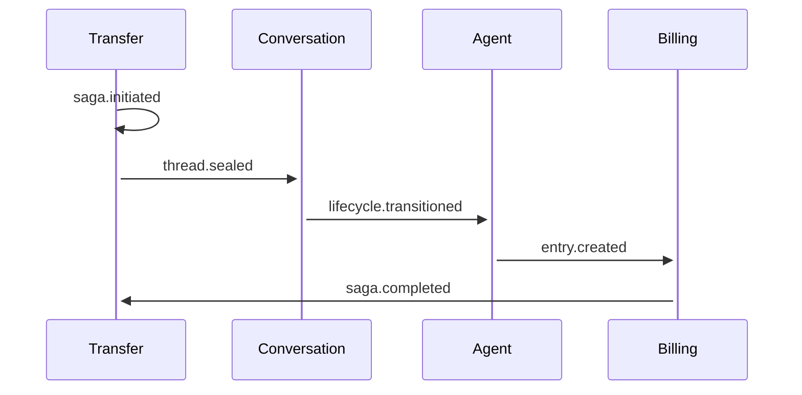

<!-- docs-version: 7.0.0 -->

# Sale Transfer Choreography

> Auto-generated from `TRANSFER_CHOREOGRAPHY.sale`. Do not edit manually.

## Forward Path (Happy)



## Compensation Path (Rollback)

```mermaid
sequenceDiagram
    participant Billing
    participant Agent
    participant Transfer

    Billing-->>-Billing: entry.voided
    Billing-->>-Agent: lifecycle.transitioned
    Agent-->>-Transfer: saga.rolled_back
```

---
*Generated by `scripts/generate-choreography-diagrams.ts`*
